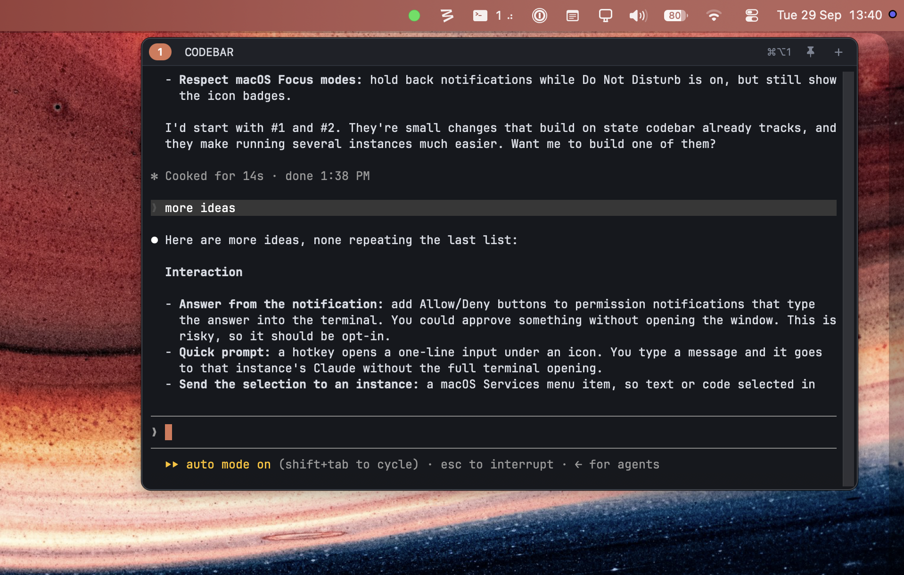

<div align="center">
<pre>
 ██████╗ ██████╗ ██████╗ ███████╗██████╗  █████╗ ██████╗ 
██╔════╝██╔═══██╗██╔══██╗██╔════╝██╔══██╗██╔══██╗██╔══██╗
██║     ██║   ██║██║  ██║█████╗  ██████╔╝███████║██████╔╝
██║     ██║   ██║██║  ██║██╔══╝  ██╔══██╗██╔══██║██╔══██╗
╚██████╗╚██████╔╝██████╔╝███████╗██████╔╝██║  ██║██║  ██║
 ╚═════╝ ╚═════╝ ╚═════╝ ╚══════╝╚═════╝ ╚═╝  ╚═╝╚═╝  ╚═╝
</pre>
</div>

A macOS menu-bar terminal for running Claude Code.

<p align="center">
  
</p>

- **Click** the menu-bar icon, or press **⌃⌥1**, to drop a terminal down under the icon. It also drops down on its own when codebar starts. It opens a plain login shell; `cd` to your project and run `claude` yourself.
- **Run several projects side by side.** Right-click the icon, then **New Instance**, to add another icon with its own terminal and session. The icons are numbered left to right, and the *n*th one toggles with **⌃⌥n**, so you can keep one Claude Code per project in the menu bar. New instances appear on the left (macOS places them there), so the numbers shift as instances come and go.
- **See what each one is doing.** Next to each instance's number in the menu bar: a spinner while Claude Code is working (`1 ⠹`), `?` while it waits on a permission prompt or a question for you (`1 ?`), and `✓` when it finished while you weren't looking (`1 ✓`, until you open it). The icon of the instance that's open is filled in, so you can tell which terminal you're looking at.
- **Get told when it needs you.** If Claude finishes, or stops to ask for permission or ask a question, while you're not looking at that terminal, you get a notification (click it to open the instance). Turn the notifications off from the right-click menu under **Notify When Claude Needs You**.
- **Change the hotkey** from the right-click menu under **Hotkey**: ⌃⌥, ⌘⌥, ⌃⇧ or ⌃⌘ plus the icon's number. It applies to every instance.
- **Resize** the window by dragging an edge or a corner. Under its icon it stays centered there (the sides move together).
- **Move** it anywhere by dragging its header, onto any screen. It opens there from then on; double-click the header (or **Move Back Under Icon** in the right-click menu) to put it back under its icon. Each instance slot remembers its size and place.
- The window hides when it loses focus. Pin it (📌 in the header, or from the right-click menu) to keep it open.
- **Drag files in** from Finder to paste their paths (images too, for Claude Code). The window stays up while you drag, even though starting the drag takes focus away.
- The header shows the name of the folder the terminal is in, in capitals (hover for the full path), and follows `cd`. **⌘O** (or click the name) restarts the session in a new directory. Each instance slot remembers its own folder.

Keys inside the terminal: ⇧↩ newline · ⌘-click a link to open it · ⌘C copy selection · ⌘V paste · ⌘K clear · ⌘N new instance · ⌘\` / ⇧⌘\` next / previous instance · ⌘+/⌘−/⌘0 zoom. **⌘W** quits the instance from anywhere in its window; if Claude is working or waiting on you it asks first (↵ quit, esc cancel).

## Install

Download the `.dmg` from the [latest release](https://github.com/agustind/codebar/releases/latest), open it and drag codebar to Applications. Needs macOS 14 or later.

## Develop

A native AppKit app in Swift; the terminal is [SwiftTerm](https://github.com/migueldeicaza/SwiftTerm).

```sh
swift run                 # debug build, straight from the terminal
./build.sh                # dist/codebar.app (universal, signed)
./build.sh release        # also notarizes it and makes dist/codebar-<version>.dmg
```

The version lives in `VERSION`. Building needs Xcode's Metal toolchain for SwiftTerm's shaders (`xcodebuild -downloadComponent MetalToolchain`), and releasing needs the `dondo` notarytool keychain profile.

## How it works

- `Sources/codebar/AppDelegate.swift`: the instances, numbering, hotkeys (Carbon `RegisterEventHotKey`) and notifications. All instances live in one process, each with its own `NSStatusItem`, window and shell.
- `Sources/codebar/Instance.swift`: one instance: its menu-bar icon, the dropdown window and its placement under the icon, and the shell session (SwiftTerm's `LocalProcessTerminalView`, which runs it in a real pty).
- `Sources/codebar/Views.swift`: the window's contents: header, exited bar, About and quit boxes, file drops.
- Current folder: every half second the header reads the working directory of the terminal's foreground process (`proc_pidinfo`), so it follows `cd`. OSC 7 from the shell works too.
- Activity: Claude Code sets the terminal title to `◐`/`◑ <title>` while it works and `✳ <title>` otherwise. codebar watches for that and animates the menu-bar title. It won't show if `CLAUDE_CODE_DISABLE_TERMINAL_TITLE` is set.
- Done or waiting: `✳` looks the same either way, so when the spinner stops codebar reads `~/.claude/sessions/<pid>.json` (the file Claude Code keeps with its `status` and `waitingFor`) for the Claude process on that instance's tty. `waiting` shows `?`; anything else counts as done.
- Numbering: macOS puts each new menu-bar icon on the left, so the icons are numbered by where they sit (⌘-dragging one renumbers too), and each hotkey follows its number. Each instance also has a slot (the lowest free one when it starts), which keeps its remembered folder.
- Settings live in `~/Library/Application Support/app.codebar/`: `store.json` (each slot's folder as `cwd.<n>` and window size and position as `size.<n>` and `pos.<n>`, `notify`) and `hotkey-modifiers`.
- Custom startup command: set the `store.json` key `command` (for example `claude`). By default there isn't one, so you get a plain shell.
